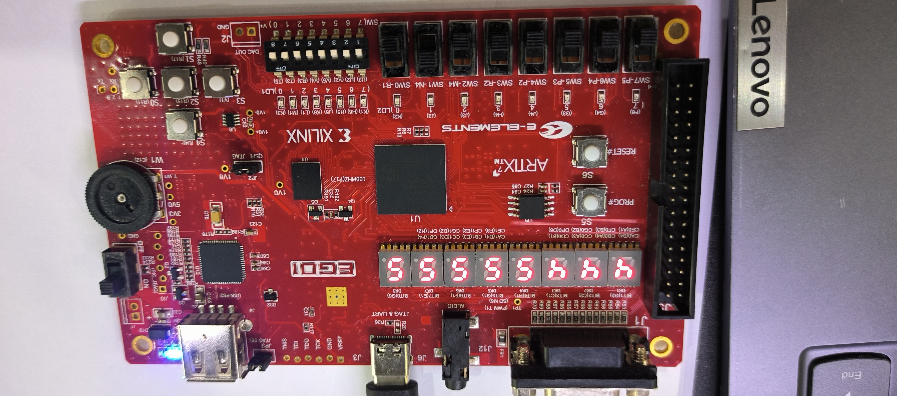

# MIPS24-Forwarding-and-Branch-Prediction-Enabled-Pipelined-CPU


The project is a 24-instruction MIPS pipelined processor designed with data forwarding and a 2-bit saturating branch predictor to improve execution efficiency and reduce pipeline stalls.

The 24 supported instructions are:

- **R-type instructions:** sll, sra, srl, add, addu, sub, and, or, nor, slt, sltu, jr, syscall

- **I-type instructions:** beq, bne, addi, andi, addiu, slti, ori, lw, sw

- **J-type instructions:** j, jal


## Environment
- Vivado 2019.2
- xc7a35tcsg324-1

## Directory
```commandline
~\MIPS24-FORWARDING-AND-BRANCH-PREDICTION-ENABLED-PIPELINED-CPU
├─MIPS24-Forwarding-and-Branch-Prediction-Enabled-Pipelined-CPU.assets
│   ├─benchmark.coe                             // Instruction memory benchmark test initialization file
│   ├─branchhazarrd.coe                         // Instruction memory branch-related test initialization file
│   ├─datahazarrd.coe                           // Instruction memory data-hazard test initialization file
│   ├─Display.jpg                               // Demo image
│   └─ini.coe                                   // Data memory initialization file
├─MIPS24-Forwarding-and-Branch-Prediction-Enabled-Pipelined-CPU.cache
├─MIPS24-Forwarding-and-Branch-Prediction-Enabled-Pipelined-CPU.hw
├─MIPS24-Forwarding-and-Branch-Prediction-Enabled-Pipelined-CPU.ip_user_files
├─MIPS24-Forwarding-and-Branch-Prediction-Enabled-Pipelined-CPU.runs
├─MIPS24-Forwarding-and-Branch-Prediction-Enabled-Pipelined-CPU.sim
└─MIPS24-Forwarding-and-Branch-Prediction-Enabled-Pipelined-CPU.srcs
    ├─constrs_1
    │  └─new
    │    └─TOP.xdc                              // Top-level constraints file
    ├─sim_1
    │  └─new
    │    ├─sim_CPU.v                            // CPU simulation code
    │    └─sim_TOP.v                            // Top-level simulation code
    │
    └─sources_1
        ├─ip
        └─new
            ├─ALU.v                             // ALU module
            ├─BTB.v                             // Branch Target Buffer (BTB) module
            ├─clk_div.v                         // Clock divider module
            ├─CPU.v                             // CPU top-level module
            ├─CS_dram.v                         // Instruction memory module
            ├─DataRelationDetect.v              // Data hazard detection module
            ├─Display.v                         // Display top-level module
            ├─DS_dram.v                         // Data memory module
            ├─EXMEM.v                           // EX/MEM pipeline register
            ├─FSM.v                             // Two-bit prediction state machine
            ├─IDEX.v                            // ID/EX pipeline register
            ├─IFID.v                            // IF/ID pipeline register
            ├─Line.v                            // Cache line
            ├─LoaduseDetect.v                   // Load-use hazard detection module
            ├─MAX8.v                            // LRU replacement selector
            ├─MEMRB.v                           // MEM/WB pipeline register
            ├─predictJump.v                     // Branch prediction module
            ├─Reg.v                             // 32-bit register
            ├─Reg1.v                            // 1-bit register
            ├─Reg2.v                            // 2-bit register
            ├─Reg4.v                            // 4-bit register
            ├─Reg6.v                            // 6-bit register
            ├─RegFile.v                         // Register file
            ├─seg7.v                            // 7-segment display decoder
            ├─SigHardCU.v                       // Hardwired control unit
            ├─SrcReg.v                          // Source register operand detection module
            └─TOP.v                             // FPGA board top-level module
```

## Usage
1. Open Target
2. Program Device

## Reference
https://github.com/Starrylay/awesome-HUST-CS-MIPS-CPU